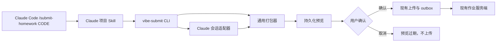

# Claude Code 作业提交设计

## 目标

让学生在 Claude Code 本地终端通过 `/submit-homework <作业编号>` 提交作业。上传协议、作业包、服务端处理、冲突处理和离线重试与现有 `vibe-submit` 保持一致。

首次安装由用户在普通终端完成；首次注册使用通用 CLI 配置。日常提交由 Claude Code 项目 Skill 发起。

## 范围与非目标

- 支持 Claude Code 本地终端会话，不支持 Claude Code 云端/Web 环境。
- 作业包保留项目代码、`screenshots/`、`report/` 与当前 Claude Code 会话。
- Claude 会话收集替换的是 Codex 会话收集，不改变代码、截图、报告的收集规则。
- 不新增 Claude 专用服务端上传 API。
- 不让 Skill 保存密码、直接访问上传 API 或自行解析会话文件。

## 架构



`vibe-submit` 负责所有业务行为；Claude Skill 只编排 CLI 并与用户对话。未来接入其他编码工具时，只增加会话适配器和工具侧 Skill/命令。

## CLI 设计

### 首次使用

用户手动安装 CLI 后，执行：

```text
vibe-submit setup
```

`setup` 复用现有学生注册、配置文件写入和 `doctor` 检查，但不执行 Codex Marketplace 注册。现有 `bootstrap` 保持不变，继续服务 Codex 的安装流程。

### Claude Code 提交

```text
/submit-homework ASSIGNMENT_CODE
  -> vibe-submit preview --code ASSIGNMENT_CODE --session-source claude
  -> 显示预览并要求用户确认
  -> vibe-submit submit-preview --preview-id PREVIEW_ID --yes
```

`preview` 创建固定 ZIP 并保存一小时。确认后上传同一份 ZIP，避免预览与提交内容不一致。

普通 `vibe-submit submit` 保持原有默认 `codex` 会话来源。`--session-source claude` 只在 Claude Skill 中使用。

## 会话适配器

将现有会话发现代码拆为来源适配器：

- `codex`：保留现有项目关联 Codex 会话扫描。
- `claude`：要求 `CLAUDE_CODE_SESSION_ID`，在 `CLAUDE_CONFIG_DIR`（默认 `~/.claude`）的项目会话目录定位对应 JSONL，并验证其属于当前项目。

Claude 适配器只能返回这个会话 ID 对应的一份 JSONL。缺少会话 ID、文件不存在、会话与项目不匹配时必须失败，不能回退到任意历史会话。

manifest 增加 `session_source: "claude_code"`；它是审计信息，不改变评分逻辑。

## Claude Code Skill

在项目中提供 `.claude/skills/submit-homework/SKILL.md`，供用户以 `/submit-homework <作业编号>` 调用。

Skill 的职责：

1. 确认 `vibe-submit` 已安装；未安装时显示手动安装与 `setup` 指引。
2. 运行 Claude 来源的预览命令。
3. 展示会话、代码、截图、报告及包大小，并提示当前会话会原样上传。
4. 等待用户明确确认。
5. 运行 `submit-preview --yes` 并报告成功、冲突或 outbox 重试信息。

## 失败处理与隐私

- 配置不存在时，提示先执行 `vibe-submit setup`。
- 课程邀请码、密码和注册错误沿用服务端既有错误码。
- 用户取消时不发送 HTTP 请求；预览自然过期。
- 网络错误或 5xx 使用现有 outbox 保存 ZIP；鉴权、校验和冲突错误不进入 outbox。
- 会话 JSONL 原样上传，但预览中必须明确给出来源和大小；确认不会默认跳过。
- 继续使用 HTTPS、Basic Auth、速率限制和服务端作业包校验。

## 服务端前提

本地服务端已更新到 `vibe-course-platform` 的 `main` 分支，并已对本地 SQLite 空库执行其内置迁移。该版本已提供密码鉴权、学生注册、小组和报告接口，因此 Claude Code 不需要新服务端协议。

当前服务端按学号查找 Basic Auth 身份；同一服务端内学生学号应保持唯一，避免跨课程同学号导致鉴权歧义。

## 测试与验收

- Claude 适配器只选择由 `CLAUDE_CODE_SESSION_ID` 指定的会话。
- 缺少会话 ID、找不到会话、会话不属于项目时安全失败。
- `preview` 与 `submit-preview` 上传完全相同的 ZIP。
- 用户取消不会调用上传 API。
- 网络失败进入 outbox 且可重试。
- Codex 默认会话收集与原有提交流程不回归。
- Claude Code 本地终端可完成安装、`setup`、预览、确认和上传。
